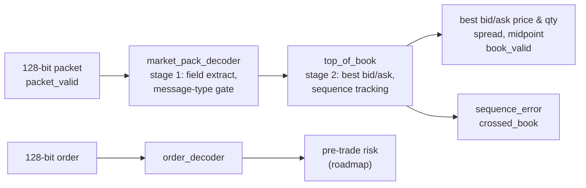

# Aegis: FPGA Market-Data & Pre-Trade Risk Pipeline

[](https://github.com/juliengaius/aegis/actions/workflows/sim.yml)

A SystemVerilog pipeline for the AMD Kria KR260 that turns a stream of market-data packets into a live top-of-book (best bid and ask), and flags the conditions a trading system must never act on silently: missed messages and crossed markets. Pre-trade risk checks and a kill switch are next on the roadmap.

**Status:** core market-data path complete and verified in simulation; board brought up; risk layer in progress.

## Why I built this

I wanted to build a complete multi-module FPGA datapath instead of the isolated blocks you get in coursework, and to learn how production RTL is designed and verified: deterministic latency, fixed-width arithmetic, overflow, and eventually streaming interfaces and backpressure. Market data is a good forcing function because the correctness rules are strict and well defined. A book that silently misses a message or reports a nonsense spread is worse than no book at all.

I've been deliberate about what I claim. Everything below is measured in simulation or synthesis. Wire-to-wire latency, Ethernet throughput, and on-board behaviour stay off this page until they're tested on real hardware.

| Result | Value | Evidence |
|---|---|---|
| Packet-to-top-of-book latency | 2 clock cycles | [`tb/market_data_pipeline_tb.sv`](tb/market_data_pipeline_tb.sv) |
| Throughput | 1 packet per clock, back-to-back | [`tb/market_data_pipeline_tb.sv`](tb/market_data_pipeline_tb.sv) |
| Verification | 30 self-checking checks across 5 testbenches, all passing | [`sim/run_tests.sh`](sim/run_tests.sh) |
| Resource use (XCK26) | 129 LUTs (0.11%), 262 flip-flops (0.11%), 0 BRAM, 0 DSP | [`reports/`](reports/market_data_pipeline_utilization_synth.rpt) |

## Architecture



Both stages are fully registered, so the path has a fixed 2-cycle latency and never stalls. `market_data_pipeline` is the top-level wrapper that connects the two stages.

### Packet format

Market-data packets and orders share one 128-bit layout, so both decoders use the same field positions:

| Bits | Field | Notes |
|---|---|---|
| `[127:126]` | message type | `01` = update; anything else is ignored |
| `[125]` | side | `0` = bid / buy, `1` = ask / sell |
| `[124:93]` | sequence number (market data) or order ID (orders) | 32 bits |
| `[92:61]` | price | fixed-point, 4 implied decimals (see ADR-002) |
| `[60:29]` | quantity | 32 bits |
| `[28:0]` | reserved | |

### What the book guarantees

- **Sequence gaps are caught.** Every update must carry the previous sequence number plus one. A gap raises `sequence_error`, which stays high (sticky), because a book that has missed a message can't be trusted until it's rebuilt.
- **Locked markets are valid.** When bid equals ask, the book reports a spread of zero. This happens in real markets and isn't an error.
- **Crossed markets are flagged, not wrapped.** If bid exceeds ask, `crossed_book` goes high and spread and midpoint are held at zero instead of producing a huge unsigned-subtraction result. The flag clears on the very next update that uncrosses the book.
- **Midpoint can't overflow.** The sum of bid and ask is taken at 33 bits before halving.

## Design decisions

Each significant decision is recorded as an architecture decision record (ADR) with the options considered and the reasoning.

- **[ADR-001: Crossed-book handling](docs/adr/ADR-001-crossed-book.md).** Locked markets are valid; crossed markets are flagged and gate spread and midpoint. The flag is deliberately non-sticky, unlike `sequence_error`.
- **[ADR-002: Price field scale](docs/adr/ADR-002-price-scale.md).** A price is stored as price × 10,000 in a 32-bit integer, matching NASDAQ ITCH's `Price(4)` format. Integer datapaths are exact (no floating-point rounding on money) and cheap in hardware.
- **[ADR-003: Sequence-gap recovery](docs/adr/ADR-003-sequence-gap-recovery.md).** After a gap, the book resyncs from a snapshot message that carries its own sequence number and becomes the new baseline, clearing `sequence_error`. Retransmission is out of scope. This mirrors how MoldUDP64/ITCH feeds are consumed in practice. Decided; implementation is the next milestone.

## Running the tests

Tests run in [Icarus Verilog](https://steveicarus.github.io/iverilog/) (free) as well as Vivado XSim.

```bash
# Ubuntu / WSL: sudo apt install iverilog     macOS: brew install icarus-verilog
./sim/run_tests.sh
```

Every testbench is self-checking: it compares outputs against expected values and stops with `$fatal` on the first mismatch, so a passing run means every check passed, not just that the simulation finished. The same script runs automatically on every push through GitHub Actions.

| Testbench | Checks | Covers |
|---|---|---|
| `market_packet_decoder_tb` | 6 | bid and ask decode, valid pulse clears, invalid message type rejected, reset |
| `order_decoder_tb` | 6 | buy and sell decode, pulse clears with data held, type gate, reset |
| `top_of_book_tb` | 10 | first bid, hold with no update, spread and midpoint, replacement, sequence gap, sticky error, locked, crossed, recovery |
| `market_pipeline_tb` | 6 | decoder and book together, stage-by-stage timing |
| `market_data_pipeline_tb` | 2 | top-level wrapper: exact 2-cycle latency, 4 back-to-back packets |

## Hardware bring-up

The KR260 is running Ubuntu 24.04 with the FPGA manager and XRT stack verified (`xmutil listapps` / `loadapp` load applications successfully), and bring-up was repeated at a second lab to confirm it's reproducible. The pipeline is not yet running on the board: its top-level ports are still wide parallel buses, which will be replaced with AXI4-Stream interfaces before on-board testing. The resource numbers above come from standalone synthesis of the logic for that reason.

## Things that went wrong

- **A regression I introduced myself.** While adding crossed-book protection, I re-typed the spread/midpoint block by hand and dropped the `!crossed_book` guard. The crossed-market test failed immediately with `$fatal` instead of passing quietly. That was the moment the test suite paid for itself.
- **A demo accelerator that wouldn't load.** `xmutil loadapp` failed with `Load Error: -1` at the U of T lab. The board was fine; the lab network blocked the board's own internet access, so the package install behind it had never run. Lesson: the board needs its own network path, separate from my laptop's.
- **No SD card slot.** My laptop can't flash the KR260's boot card, so I imaged Ubuntu on a borrowed MacBook's card reader. A USB microSD adapter is on the shopping list.

## Repository layout

```
rtl/        synthesizable SystemVerilog
tb/         self-checking testbenches
sim/        test runner script
reports/    Vivado synthesis reports
docs/adr/   architecture decision records
```

## Roadmap

- [x] Packet decoder with message-type gating
- [x] Top-of-book with sequence-gap detection
- [x] Locked and crossed-market handling
- [x] Order decoder
- [ ] Snapshot resync (ADR-003)
- [ ] Pre-trade risk checks (price bands, size limits)
- [ ] Kill switch and order throttle
- [ ] Python reference model and randomized differential testing
- [ ] AXI4-Stream interfaces and FIFOs
- [ ] Timing closure and on-board run on the KR260

## Tools

SystemVerilog · Vivado / Vitis 2025.2 · XSim · Icarus Verilog · AMD Kria KR260 (XCK26)
